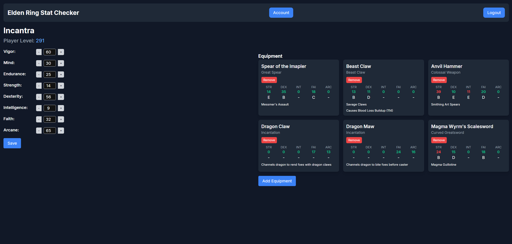

# Elden Ring Equipment Manager

## Description

Elden Ring Equipment Manager is a web-based application designed to help players manage their character’s equipment. Users can add, view, and remove equipment while monitoring whether their character meets the stat requirements for each piece of gear. The app provides dynamic stat validation with conditional styling, giving a clear overview of which items are usable based on the character's attributes.

## Screenshot

## Table of Contents

- [Installation](#installation)
- [Usage](#usage)
- [License](#license)
- [How to Contribute](#contributing)
- [Test](#test)
- [Questions](#questions)

## Installation

N/A

## Usage

### Home Page

1. Accessing the Application:

* Navigate to the home page of the application.
* You will be greeted with a welcome message and options to either sign up or log in.

2. Sign Up/Login:

* Click on the Signup button if you are a new user.
* Click on the Login button if you already have an account.

### Account Page

1. Viewing Characters:

* After logging in, you will be directed to your account page.
* Here, you can see a list of your characters.

2. Adding a New Character:

* Click on the Create New Character button.
* A modal will appear where you can enter the new character's name.
* Submit the form to add the character to your list.

3. Removing a Character:

* In the list of characters, click on the Remove button next to the character you wish to delete.
* Confirm the removal to delete the character from your list.

4. Viewing Character Details:

* Click on the View Details button next to a character to navigate to the character's detailed view page.

### Character Page

1. Updating Character Stats:

* On the character detail page, you can view and update the character’s stats.
* Adjust the stats using the increment and decrement buttons or by typing directly into the input fields.
* Click Save to update the character's stats.

2. Managing Equipment:

* The equipment section displays all equipment associated with the character.
* You can view details of each piece of equipment, including stat requirements and scaling.

3. Adding Equipment:

* Click on the Add Equipment button to open the equipment input modal.
* Fill out the form with the equipment details and click Save to add it to the character's equipment list.

4. Removing Equipment:

* In the equipment list, click on the Remove button next to the equipment you want to delete.
* Confirm the removal to delete the equipment.

5. Visual Indicators:

* Each piece of equipment will show whether your current stats meet its requirements.
* Stat requirements will be highlighted in green if met and red if unmet.

This guide helps you navigate and use the application effectively. If you encounter any issues or need further assistance, please refer to the other sections of the README or contact support.

## Contributing

Contributions are welcome! To contribute:

 1. Fork the repository.
 2. Create a new branch with your feature or bugfix.
 3. Commit your changes.
 4. Submit a pull request.

 ## Questions

 My Github account is GitHub.com/midasantiago

If you wish to contact me, you can do so at mida.santiago98@gmail.com
